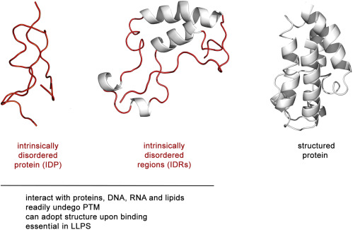

# Awesome IDR Prediction: Labs & Tools 

  
  

  

## Repository Introduction
🤩 Welcome to our curated list of Computational Protein Intrinsic Disorder Prediction labs AND tools!

This repository is a **specialized, community-maintained** resource focused exclusively on **computational prediction of Intrinsically Disordered Regions (IDRs)**—a core subfield of IDR research. Unlike broad IDR hubs, it zeroes in on tools, methods, and labs that solve the critical challenge of identifying IDRs from protein sequences (residue-level disorder probability, segment-level disorder boundaries, or context-specific disorder).  
Our focus is on **actionable computational resources**: every entry includes direct access to tools (web servers/GitHub repos), links to the labs driving innovation, and supporting publications to validate method credibility. Whether you are a student new to IDR prediction or a researcher seeking state-of-the-art tools for your analysis, this repo centralizes the resources you need to avoid redundant searches and accelerate your work.  

> 📝 Note: The "Tools Section" of the list is based primarily on [CAID](https://caid.idpcentral.org/methods) (a community-based blind **test** to determine the state of the art in prediction of intrinsically disordered regions and the subset of residues involved in binding). 

> ⚠️ For any collected tool that lacks literature publication details (whether papers or preprints), the source of the information we selected is highly likely to be the [CAID Competition/Leaderboard](https://caid.idpcentral.org/methods). 

## Contributing / 贡献指南

EN
- Keep README entries short: Paper, 1‑line Abstract, 1‑line Model/Method, and Access.
- Put long Abstract/Method into `docs/<surname>-lab.md` with headings “ToolName Abstract” and “ToolName Model/Method”; link from README with “Read more →”.
- For unpublished tools, add a Note (⚠️ No peer‑reviewed publication yet; status: experimental) and cite a verifiable source (e.g., preprint or CAID).
- Include at least one working Access item (Web, GitHub, Docker, API docs, bio.tools, PyPI).
- Use lowercase hyphenated anchors; create/update `docs/<surname>-lab.md` for new labs.

中文
- README 保持精简：Paper、1 行 Abstract、1 行 Model/Method、Access。
- 长内容放到 `docs/<surname>-lab.md`，用 “ToolName Abstract / ToolName Model/Method” 标题，并在 README 用 “Read more →” 链接。
- 未发表工具加 Note（⚠️ 未经同行评审；实验性）并注明可核实来源（preprint / CAID）。
- 至少提供一个可访问资源（Web/GitHub/Docker/API/bio.tools/PyPI 等）。
- 标题/锚点用小写连字符；新增实验室请新建/更新对应 `docs/<surname>-lab.md`。

⚠️ Use the PR template when submitting: `.github/pull_request_template.md`.

## Table of Contents

<!-- TOC -->
Quick links:

- [Awesome IDR Prediction: Labs \& Tools](#awesome-idr-prediction-labs--tools)
  - [Repository Introduction](#repository-introduction)
  - [Contributing / 贡献指南](#contributing--贡献指南)
  - [Table of Contents](#table-of-contents)
  - [North America](#north-america)
    - [United States](#united-states)
      - [Washington University in St. Louis](#washington-university-in-st-louis)
      - [Virginia Commonwealth University](#virginia-commonwealth-university)
      - [Toyota Technological Institute at Chicago](#toyota-technological-institute-at-chicago)
      - [University of New Orleans](#university-of-new-orleans)
      - [University of Missouri](#university-of-missouri)
      - [Temple University](#temple-university)
    - [Canada](#canada)
      - [University of British Columbia](#university-of-british-columbia)
  - [South America](#south-america)
    - [Argentina](#argentina)
      - [IIBIO, CONICET-UNSAM](#iibio-conicet-unsam)
  - [EMEA](#emea)
    - [United Kingdom](#united-kingdom)
      - [University College London](#university-college-london)
      - [University of Exeter](#university-of-exeter)
      - [University of Cambridge](#university-of-cambridge)
    - [Germany](#germany)
      - [Humboldt-Universität zu Berlin](#humboldt-universität-zu-berlin)
      - [Technical University of Munich](#technical-university-of-munich)
    - [Hungary](#hungary)
      - [Eötvös Loránd University](#eötvös-loránd-university)
    - [Italy](#italy)
      - [University of Padua](#university-of-padua)
    - [Belgium](#belgium)
      - [Vrije Universiteit Brussel](#vrije-universiteit-brussel)
    - [Poland](#poland)
      - [Silesian University of Technology](#silesian-university-of-technology)
    - [Ireland](#ireland)
      - [University College Dublin](#university-college-dublin)
    - [France](#france)
      - [Sorbonne University](#sorbonne-university)
    - [Sweden](#sweden)
      - [Linköping University](#linköping-university)
  - [Asia](#asia)
    - [China](#china)
      - [Beijing Institute of Technology 北京理工大学](#beijing-institute-of-technology-北京理工大学)
      - [Central South University 中南大学](#central-south-university-中南大学)
      - [Sun Yat-sen University 中山大学](#sun-yat-sen-university-中山大学)
      - [Institute for Systems and Physical Biology， Shenzhen Bay Laboratory](#institute-for-systems-and-physical-biology-shenzhen-bay-laboratory)
    - [Japan](#japan)
      - [Maebashi Institute of Technology](#maebashi-institute-of-technology)
    - [Russia](#russia)
      - [Institute of Protein Research, RAS](#institute-of-protein-research-ras)
    - [North Korea](#north-korea)
      - [University of Sciences, Pyongyang](#university-of-sciences-pyongyang)
  - [TODO: model graph](#todo-model-graph)
<!-- /TOC -->

<em>Maintenance note: Quick links use GitHub heading anchors. Slugs are lowercase with hyphens; accents are stripped (ü → u, ö → o) while CJK stays as-is. When adding a new school, ensure a “#### University …” heading exists, then add it here using its slug. For entries without a heading inside details, add a small heading above to enable linking.</em>

## North America
### United States

#### Washington University in St. Louis     

Alex S. Holehouse

- Lab website: [holehouse lab](https://www.holehouselab.com/)

- Tools
  - Metapredict: Metapredict-v1, v2, v3
    - Paper: 
      - [Metapredict: a fast, accurate, and easy-to-use predictor of consensus disorder and structure](https://www.cell.com/biophysj/fulltext/S0006-3495(21)00725-6?_returnURL=https%3A%2F%2Flinkinghub.elsevier.com%2Fretrieve%2Fpii%2FS0006349521007256%3Fshowall%3Dtrue) (Biophysical Journal, 2021)
      - [Metapredict enables accurate disorder prediction across the Tree of Life](https://www.biorxiv.org/content/10.1101/2024.11.05.622168v1) (⚠️ bioRxiv preprint, 2024)
    - Abstract: [Read more →](docs/Holehouse-lab.md#metapredict-abstract)
    - Model/Method: [Read more →](docs/Holehouse-lab.md#metapredict-modelmethod)
    - Access:
      - Web server: https://metapredict.net/ | [Batch disorder predictions using metapredict v3](https://colab.research.google.com/drive/1UOrOxun9i23XDE8lFo_4I89Tw8P3Z1D-?usp=sharing) | [Integrated into the CAID Prediction Portal](https://caid.idpcentral.org/portal)
      - REST API: N/A
      - Docker image: N/A
      - GitHub repository: https://github.com/idptools/metapredict | [Documentation](https://metapredict.readthedocs.io/en/latest/)
      - Others: https://pypi.org/project/metapredict/ | https://bio.tools/metapredict

#### Virginia Commonwealth University     

Lukasz Kurgan

- Lab website: [Biomine Kurgan Lab](https://biomine.cs.vcu.edu/)

- Tools
  - APOD
    - Paper: [APOD: accurate sequence-based predictor of disordered flexible linkers](https://academic.oup.com/bioinformatics/article/36/Supplement_2/i754/6055918?login=false) (Bioinformatics, 2020)
    - Abstract: [Read more →](docs/Kurgan-lab.md#apod-abstract)
    - Model/Method: [Read more →](docs/Kurgan-lab.md#apod-modelmethod)
    - Access:
      - Web server: https://yanglab.qd.sdu.edu.cn/APOD/ | [Integrated into the CAID Prediction Portal](https://caid.idpcentral.org/portal)
      - REST API: N/A
      - Docker image: N/A
      - GitHub repository: N/A
      - Others: https://yanglab.nankai.edu.cn/tmp/CAID2_packages/APOD_20220524_CAID2.tar.gz | https://bio.tools/apod
  - flDPnn: 
    - Paper: [flDPnn: Accurate intrinsic disorder prediction with putative propensities of disorder functions](https://www.nature.com/articles/s41467-021-24773-7) (Nature Communications, 2021)
    - Abstract: [Read more →](docs/Kurgan-lab.md#fldpnn-abstract)
    - Model/Method: [Read more →](docs/Kurgan-lab.md#fldpnn-modelmethod)
    - Access:
      - Web server: https://biomine.cs.vcu.edu/server-handler/?type=servers&target=flDPnn/ | [Integrated into the CAID Prediction Portal](https://caid.idpcentral.org/portal)
      - REST API: N/A
      - Docker image: https://gitlab.com/sina.ghadermarzi/fldpnn_docker
      - GitHub repository: N/A
      - Others: [source code](https://gitlab.com/sina.ghadermarzi/fldpnn) | https://bio.tools/fldpnn
  - flDPlr、flDPlr2:
    - Paper: N/A
    - Abstract: N/A
    - Model/Method: [Read more →](docs/Kurgan-lab.md#fldplr-modelmethod)
    - Access:
      - Web server: [Integrated into the CAID Prediction Portal](https://caid.idpcentral.org/portal)
      - REST API: N/A
      - Docker image: N/A
      - GitHub repository: N/A
      - Others: N/A
  - flDPnn2
    - Paper: [flDPnn2: Accurate and Fast Predictor of Intrinsic Disorder in Proteins](https://www.sciencedirect.com/science/article/abs/pii/S0022283624002006?via%3Dihub) (Journal of Molecular Biology, 2024)
    - Abstract: [Read more →](docs/Kurgan-lab.md#fldpnn2-abstract)
    - Description/Method: [Read more →](docs/Kurgan-lab.md#fldpnn2-modelmethod)
    - Access:
      - Web server: https://biomine.cs.vcu.edu/servers/flDPnn2/ | [Integrated into the CAID Prediction Portal](https://caid.idpcentral.org/portal)
      - REST API: N/A
      - Docker image: N/A
      - GitHub repository: N/A
      - Others: N/A
  - flDPnn3: flDPnn3a, flDPnn3b 
    - Paper: N/A
    - Abstract: N/A
    - Description/Method: [Read more →](docs/Kurgan-lab.md#fldpnn3-modelmethod)
    - Access:
      - Web server: N/A
      - REST API: N/A
      - Docker image: N/A
      - GitHub repository: N/A
      - Others: N/A
 

#### Toyota Technological Institute at Chicago     

Jinbo Xu 许锦波

- Lab website: [Profile](https://home.ttic.edu/~jinbo/)

- Tools
  - AUCpreD
    - Paper: [AUCpreD: proteome-level protein disorder prediction by AUC-maximized deep convolutional neural fields](https://academic.oup.com/bioinformatics/article/32/17/i672/2450776?login=false) (Bioinformatics, 2016)
    - Abstract: [Read more →](docs/Xu-lab.md#aucpred-abstract)
    - Description/Method: [Read more →](docs/Xu-lab.md#aucpred-modelmethod)
    - Access:
      - Web server: http://raptorx2.uchicago.edu/StructurePropertyPred/predict/ | [Integrated into the CAID Prediction Portal](https://caid.idpcentral.org/portal)
      - REST API: N/A
      - Docker image: N/A
      - GitHub repository
https://github.com/realbigws/RaptorX_Property_Fast
      - Others: https://bio.tools/aucpred

#### University of New Orleans     

   

Md Tamjidul Hoque

- Lab website: [PI lab](https://tamjidul.github.io/)

- Tools
  - DisPredict2
    - Paper: [Estimation of Position Specific Energy as a Feature of Protein Residues from Sequence Alone for Structural Classification](https://journals.plos.org/plosone/article?id=10.1371/journal.pone.0161452) (PLoS ONE, 2016)
    - Abstract: [Read more →](docs/Hoque-lab.md#dispredict2-abstract)
    - Description/Method: [Read more →](docs/Hoque-lab.md#dispredict2-modelmethod)
    - Access:
      - Web server: [Integrated into the CAID Prediction Portal](https://caid.idpcentral.org/portal)
      - REST API: N/A
      - Docker image: N/A
      - GitHub repository: https://github.com/tamjidul/DisPredict2_PSEE
      - Others: https://bio.tools/dispredict2
  - DisPredict3 
    - Paper: [DisPredict3.0: Prediction of intrinsically disordered regions/proteins using protein language model](https://www.sciencedirect.com/science/article/abs/pii/S0096300324001024?via%3Dihub) (Applied Mathematics and Computation, 2024)
    - Abstract: [Read more →](docs/Hoque-lab.md#dispredict30-abstract)
    - Description/Method: [Read more →](docs/Hoque-lab.md#dispredict30-modelmethod)
    - Access:
      - Web server: [Integrated into the CAID Prediction Portal](https://caid.idpcentral.org/portal)
      - REST API: N/A
      - Docker image: N/A
      - GitHub repository: https://github.com/wasicse/Dispredict3.0
      - Others: N/A 
  - ESMDisPred: ESMDisPred-1, ESMDisPred-2, ESMDisPred-2PDB
    - Paper: N/A
    - Abstract: [Read more →](docs/Hoque-lab.md#esmdispred-abstract)
    - Description/Method: [Read more →](docs/Hoque-lab.md#esmdispred-modelmethod)
      - Access:
        - Web server: N/A
        - REST API: N/A
        - Docker image: https://hub.docker.com/r/wasicse/esmdispred
        - GitHub repository: https://github.com/wasicse/ESMDisPred
        - Others: N/A 

#### University of Missouri     

Jianlin (Jack) Cheng 程建林

- Lab website: [Bioinformatics and Machine Learning Laboratory](https://calla.rnet.missouri.edu/cheng/jianlin.cheng.html)

- Tools
  - PreDisorder
    - Paper: [PreDisorder: ab initio sequence-based prediction of protein disordered regions](https://bmcbioinformatics.biomedcentral.com/articles/10.1186/1471-2105-10-436) (BMC Bioinformatics, 2009)
    - Abstract: [Read more →](docs/Cheng-lab.md#predisorder-abstract)
    - Model/Method: [Read more →](docs/Cheng-lab.md#predisorder-modelmethod)
    - Access:
      - Web server: http://casp.rnet.missouri.edu/predisorder.html | [Integrated into the CAID Prediction Portal](https://caid.idpcentral.org/portal)
      - REST API: N/A
      - Docker image: N/A
      - GitHub repository
      - Others: https://bio.tools/predisorder | https://multicom-toolbox.mu.hekademeia.org/tools.html#license

#### Temple University      

Zoran Obradovic

- Lab website: [Zoran Obradovic’s Lab](https://dabi.temple.edu/zoran-obradovic/lab/) 

- Tools
  - VSL2
    - Paper: [Length-dependent prediction of protein intrinsic disorder](https://bmcbioinformatics.biomedcentral.com/articles/10.1186/1471-2105-7-208) (BMC Bioinformatics, 2006)
    - Abstract: [Read more →](docs/Obradovic-lab.md#vsl2-abstract)
    - Model/Method: [Read more →](docs/Obradovic-lab.md#vsl2-modelmethod)
    - Access:
      - Web server: https://www.ist.temple.edu/disprot/predictorVSL2.php | [Integrated into the CAID Prediction Portal](https://caid.idpcentral.org/portal)
      - REST API: N/A 
      - Docker image: N/A
      - GitHub repository: N/A
      - Others: N/A

### Canada
#### University of British Columbia     

Nawar Malhis

- Lab website: [Gsponer Lab - Michael Smith Laboratories](https://gsponerlab.msl.ubc.ca/) | [Profile](https://gsponerlab.msl.ubc.ca/people/nawar-malhis/)

- Tools
  - IPA(IDR Probabilistic Annotation): IPA-AF2-Linker 
    - Paper: [Probabilistic Annotations of Protein Sequences for Intrinsically Disordered Features](https://www.biorxiv.org/content/10.1101/2024.12.18.629275v2.full) (⚠️ bioRxiv preprint, 2025)
  - Abstract: [Read more →](docs/Malhis-lab.md#ipa-abstract)
  - Description/Method: [Read more →](docs/Malhis-lab.md#ipa-modelmethod)
    - Access:
      - Web server: [Integrated into the CAID Prediction Portal](https://caid.idpcentral.org/portal)
      - REST API: N/A
      - Docker image: N/A
      - GitHub repository: https://github.com/NawarMalhis/IPA
      - Others: orca.msl.ubc.ca/nmshare/ipa.tar.gz | https://bio.tools/ipa_idr_probabilistic_annotations

## South America
### Argentina
#### IIBIO, CONICET-UNSAM     

Lucia Beatriz Chemes

- Lab website: [Profile](https://bicyt.conicet.gov.ar/fichas/p/lucia-beatriz-chemes)

- Tools
  - LINKER-Pred: LINKER-Pred, LINKER-Pred-Lite, LINKER-Pred2
    - Paper: [LINKER-Pred: A Public Web Server for Accurate Prediction of Disordered Flexible Linkers in Proteins](https://www.biorxiv.org/content/10.1101/2025.10.29.685455v1) (⚠️ bioRxiv preprint, 2025)
  - Abstract: [Read more →](docs/Chemes-lab.md#linker-pred-abstract)
  - Description/Method: [Read more →](docs/Chemes-lab.md#linker-pred-modelmethod)
    - Access:
      - Web server: https://pcrgwd.ucd.ie/linker_pred/
      - REST API: N/A
      - Docker image: N/A
      - GitHub repository: https://github.com/deemeng/punch_linker
      - Others: N/A

## EMEA

### United Kingdom
#### University College London     

David T. Jones

- Lab website: [UCL Bioinformatics Group](https://bioinf.cs.ucl.ac.uk/) | [Profile](http://www0.cs.ucl.ac.uk/staff/d.jones/)

- Tools
  - DISOPRED3: DISOPRED3-diso
    - Paper: [DISOPRED3: precise disordered region predictions with annotated protein-binding activity](https://academic.oup.com/bioinformatics/article/31/6/857/215129?login=false) (Bioinformatics, 2014)
    - Abstract: [Read more →](docs/Jones-lab.md#disopred3-abstract)
    - Description/Method: [Read more →](docs/Jones-lab.md#disopred3-modelmethod)
    - Access:
      - Web server: [Integrated into the CAID Prediction Portal](https://caid.idpcentral.org/portal)
      - REST API: N/A
      - Docker image: N/A
      - GitHub repository: https://github.com/psipred/disopred
      - Others: https://bioinf.cs.ucl.ac.uk/downloads/DISOPRED/ | https://bio.tools/disopred3 

#### University of Exeter     

Zheng Rong Yang

- Lab website: [Profile](https://scholargps.com/scholars/45992467342875/zheng-rong-yang | https://www.scilit.com/scholars/172034)

- Tools
  - RONN
    - Paper: [RONN: the bio-basis function neural network technique applied to the detection of natively disordered regions in proteins](https://academic.oup.com/bioinformatics/article/21/16/3369/215577?login=false) (Bioinformatics, 2005)
    - Abstract: [Read more →](docs/Yang-lab.md#ronn-abstract)
    - Model/Method: [Read more →](docs/Yang-lab.md#ronn-modelmethod)
    - Access:
      - Web server: http://www.strubi.ox.ac.uk/RONN | [Integrated into the CAID Prediction Portal](https://caid.idpcentral.org/portal)
      - REST API: N/A
      - Docker image: N/A
      - GitHub repository: https://github.com/varun-ramraj/RONN | [Part of BioJava project](https://github.com/biojava/biojava)
      - Others: [Details](http://www.strubi.ox.ac.uk/RONN3_Supplementary.pdf) | https://bio.tools/ronn

#### University of Cambridge     

Michele Vendruscolo

- Lab website: [Vendruscolo lab]([url link](https://www-vendruscolo.ch.cam.ac.uk/)) | [Centre for Misfolding Diseases](https://www.cmd.ch.cam.ac.uk/)

- Tools
  - s2D-2
    - Paper: [The s2D Method: Simultaneous Sequence-Based Prediction of the Statistical Populations of Ordered and Disordered Regions in Proteins](https://www.sciencedirect.com/science/article/pii/S002228361400641X?via%3Dihub) (Journal of Molecular Biology, 2014)
    - Abstract: [Read more →](docs/Vendruscolo-lan.md#s2d-2-abstract)
    - Model/Method: [Read more →](docs/Vendruscolo-lan.md#s2d-2-modelmethod)
    - Access:
      - Web server: https://www-cohsoftware.ch.cam.ac.uk/index.php/user_not_registered | https://www-cohsoftware.ch.cam.ac.uk// |  [Integrated into the CAID Prediction Portal](https://caid.idpcentral.org/portal)
      - REST API: N/A 
      - Docker image: N/A
      - GitHub repository: N/A
      - Others: https://bio.tools/s2d

### Germany
#### Humboldt-Universität zu Berlin     

Rune Linding

- Lab website: [co-PI of the Klipp-Linding Lab](https://rumo.biologie.hu-berlin.de/tbp/index.php/en/)

- Tools
  - DisEMBL: DisEMBL-dis465, DisEMBL-disHL
    - Paper: [Protein disorder prediction: implications for structural proteomics](https://www.cell.com/structure/fulltext/S0969-2126(03)00235-1?_returnURL=https%3A%2F%2Flinkinghub.elsevier.com%2Fretrieve%2Fpii%2FS0969212603002351%3Fshowall%3Dtrue) (Structure, 2003)
    - Abstract: [Read more →](docs/Klipp-Linding-lab.md#disembl-abstract)
    - Description/Method: [Read more →](docs/Klipp-Linding-lab.md#disembl-modelmethod) 
    - Access:
      - Web server: [Integrated into the CAID Prediction Portal](https://caid.idpcentral.org/portal)
      - REST API: N/A
      - Docker image: N/A
      - GitHub repository: N/A
      - Others: http://dis.embl.de/ | https://bio.tools/disembl

#### Technical University of Munich

Burkhard Rost

- Lab website: [Rostlab](https://www.cs.cit.tum.de/bio/home/) 

- Tools
  - SETH: SETH-0, SETH-1
    - Paper: [SETH predicts nuances of residue disorder from protein embeddings](https://www.frontiersin.org/journals/bioinformatics/articles/10.3389/fbinf.2022.1019597/full) (Front. Bioinform, 2022)
    - Abstract: [Read more →](docs/Rost-lab.md#seth-abstract)
    - Model/Method: [Read more →](docs/Rost-lab.md#seth-modelmethod)
    - Access:
      - Web server: [Integrated into the CAID Prediction Portal](https://caid.idpcentral.org/portal)
      - REST API: N/A 
      - Docker image: N/A
      - GitHub repository: https://github.com/DagmarIlz/SETH
      - Others: https://bio.tools/seth_1

Julius Schlensok

- Lab website: [Profile](https://schlensok.org/) (⚠️ Not sure if he is a PI)

- Tools
  - UdonPred: UdonPred-combined, UdonPred-DisProt, UdonPred-TriZOD
    - Paper: N/A
    - Abstract: N/A
    - Model/Method: [Read more →](docs/Schlensok-lab.md#udonpred-modelmethod)
    - Access:
      - Web server: N/A
      - REST API: N/A 
      - Docker image: N/A
      - GitHub repository: https://github.com/JSchlensok/udonpred
      - Others: N/A

###  Hungary
####  Eötvös Loránd University

Zsuzsanna Dosztányi

- Lab website: [Dosztányi lab](https://dlab.elte.hu/)
- Tools:
  - AIUPred
    - Paper: [AIUPred: combining energy estimation with deep learning for the enhanced prediction of protein disorder](https://academic.oup.com/nar/article/52/W1/W176/7673484) (Nucleic Acids Research, 2024)
    - Abstract: [Read more →](docs/Dosztányi-lab.md#aiupred-abstract)
    - Model/Method: [Read more →](docs/Dosztányi-lab.md#aiupred-modelmethod)
    - Access:
      - Web server: https://aiupred.elte.hu/ | [Integrated into the CAID Prediction Portal](https://caid.idpcentral.org/portal)
      - REST API: [API docs](https://aiupred.elte.hu/help)
      - Docker image: N/A
      - GitHub repository: https://github.com/doszilab/AIUPred
      - Others: N/A
  - IUPred3
    - Paper: [IUPred3: prediction of protein disorder enhanced with unambiguous experimental annotation and visualization of evolutionary conservation](https://academic.oup.com/nar/article/49/W1/W297/6287841?login=false) (Nucleic Acids Research, 2021)
    - Abstract: [Read more →](docs/Dosztányi-lab.md#iupred3-abstract)
    - Model/Method: [Read more →](docs/Dosztányi-lab.md#iupred3-modelmethod)
    - Access:
      - Web server: https://iupred3.elte.hu/ | [Integrated into the CAID Prediction Portal](https://caid.idpcentral.org/portal)
      - REST API: [API docs](https://iupred3.elte.hu/help_new)
      - Docker image: N/A
      - GitHub repository: N/A
      - Others: https://bio.tools/iupred3
  - AIUPred-2: AIUPred-2-disorder
    - Paper: N/A
    - Abstract: N/A
    - Model/Method: [Read more →](docs/Dosztányi-lab.md#aiupred-2-modelmethod)
    - Access:
      - Web server: N/A
      - REST API: N/A
      - Docker image: N/A
      - GitHub repository: N/A

### Italy
#### University of Padua     

Silvio C. E. Tosatto

- Lab website: [Profile](https://biocomputingup.it/person/silvio-c-e-tosatto/ | https://protein.bio.unipd.it/people/silvio)

- Tools
  - AlphaFold-disorder: AlphaFold-pLDDT, AlphaFold-rsa, AlphaFold-binding
    - Paper: [Intrinsic protein disorder and conditional folding in AlphaFoldDB](https://pmc.ncbi.nlm.nih.gov/articles/PMC9601767/) (Protein Sci, 2022)
    - Abstract: [Read more →](docs/Tosatto-lab.md#alphafold-disorder-abstract)
    - Model/Method: [Read more →](docs/Tosatto-lab.md#alphafold-disorder-modelmethod)
    - Access:
      - Web server: [Integrated into the CAID Prediction Portal](https://caid.idpcentral.org/portal)
      - REST API: N/A
      - Docker image: N/A
      - GitHub repository: https://github.com/BioComputingUP/AlphaFold-disorder
      - Others: N/A
  - AlphaFold3-disorder: AlphaFold-binding, AlphaFold-pLDDT, AlphaFold-rsa 
    - Paper: N/A 
    - Abstract: [Read more →](docs/Tosatto-lab.md#alphafold3-disorder-abstract)
    - Model/Method: [Read more →](docs/Tosatto-lab.md#alphafold3-disorder-modelmethod)
    - Access:
      - Web server: N/A
      - REST API: N/A
      - Docker image: N/A
      - GitHub repository: N/A
      - Others: N/A
  - ESpritz: ESpritz-D, ESpritz-N, ESpritz-X
    - Paper: [ESpritz: accurate and fast prediction of protein disorder](https://academic.oup.com/bioinformatics/article/28/4/503/211681) (Bioinformatics, 2011)
    - Abstract: [Read more →](docs/Tosatto-lab.md#espritz-abstract)
    - Model/Method: [Read more →](docs/Tosatto-lab.md#espritz-modelmethod)
    - Access:
      - Web server: http://old.protein.bio.unipd.it/espritz/ |  [Integrated into the CAID Prediction Portal](https://caid.idpcentral.org/portal)
      - REST API: N/A
      - Docker image: N/A
      - GitHub repository: N/A
      - Others: https://bio.tools/espritz
  - MobiDB-lite
    - Paper: [MobiDB-lite: fast and highly specific consensus prediction of intrinsic disorder in proteins](https://academic.oup.com/bioinformatics/article/33/9/1402/2908909?login=false) (Bioinformatics, 2017)
    - Abstract: [Read more →](docs/Tosatto-lab.md#mobidb-lite-abstract)
    - Model/Method: [Read more →](docs/Tosatto-lab.md#mobidb-lite-modelmethod)
    - Access:
      - Web server: https://mobidb.org/ | [Integrated into the CAID Prediction Portal](https://caid.idpcentral.org/portal) 
      - REST API: [API docs](https://mobidb.org/help#swagger)
      - Docker image: N/A
      - GitHub repository: N/A   
      - Others: N/A
  - MobiDB-lite 4.0
    - Paper: [MobiDB-lite 4.0: faster prediction of intrinsic protein disorder and structural compactness](https://academic.oup.com/bioinformatics/article/41/5/btaf297/8128331?login=false) (Bioinformatics, 2025)
    - Abstract: [Read more →](docs/Tosatto-lab.md#mobidb-lite-40-abstract)
    - Model/Method: [Read more →](docs/Tosatto-lab.md#mobidb-lite-40-modelmethod)
    - Access:
      - Web server: [Integrated into the CAID Prediction Portal](https://caid.idpcentral.org/portal) 
      - REST API: N/A
      - Docker image: https://github.com/BioComputingUP/MobiDB-lite_docker
      - GitHub repository: https://github.com/BioComputingUP/MobiDB-lite | [IDRPred，a modern implementation of MobiDB-lite](https://github.com/matthiasblum/idrpred)
      - Others: N/A

### Belgium
#### Vrije Universiteit Brussel     

Wim Vranken

- Lab website: [Bio2Byte group](https://bio2byte.be/info/)

- Tools
  - DisoMine
    - Paper: [Prediction of Disordered Regions in Proteins with Recurrent Neural Networks and Protein Dynamics](https://www.sciencedirect.com/science/article/abs/pii/S0022283622001590?via%3Dihub) (Journal of Molecular Biology, 2022)
    - Abstract: [Read more →](docs/Vranken-lab.md#disomine-abstract)
    - Model/Method: [Read more →](docs/Vranken-lab.md#disomine-modelmethod)
    - Access:
      - Web server: https://bio2byte.be/b2btools/disomine/ | [Integrated into the CAID Prediction Portal](https://caid.idpcentral.org/portal) 
      - REST API: [API docs](https://bio2byte.be/b2btools/documentation/disomine/)
      - Docker image: N/A
      - GitHub repository: https://github.com/bio2byte/
      - Others: https://pypi.org/project/b2bTools/ (⚠️ DisoMine is one of the available predictors the package provided) | https://bio.tools/disomine

### Poland
#### Silesian University of Technology     

Katarzyna Stapor

- Lab website: [Profile](https://english.swps.pl/katarzyna-stapor)

- Tools
  - DisorderUnetLM
    - Paper: [DisorderUnetLM: Validating ProteinUnet for efficient protein intrinsic disorder prediction](https://www.sciencedirect.com/science/article/abs/pii/S0010482524016718) (Computers in Biology and Medicine, 2024)
    - Abstract: [Read more →](docs/Stapor-lab.md#disorderunetlm-abstract)
    - Model/Method: [Read more →](docs/Stapor-lab.md#disorderunetlm-modelmethod)
    - Access:
      - Web server: N/A
      - REST API: N/A
      - Docker image: N/A
      - GitHub repository: N/A
      - Others: https://codeocean.com/capsule/0867702/tree/v1 

### Ireland
#### University College Dublin   

Gianluca Pollastri

- Lab website: [Profile](https://people.ucd.ie/gianluca.pollastri/)

- Tools
  - PUNCH2: PUNCH2-Light, PUNCH2
    - Paper: [PUNCH2: Explore the strategy for intrinsically disordered protein predictor](https://journals.plos.org/plosone/article?id=10.1371/journal.pone.0319208) (PLoS ONE, 2025)
    - Abstract: [Read more →](docs/Pollastri-lab.md#punch2-abstract)
    - Model/Method: [Read more →](docs/Pollastri-lab.md#punch2-modelmethod)
    - Access:
      - Web server: N/A
      - REST API: N/A
      - Docker image: N/A
      - GitHub repository: https://github.com/deemeng/punch2 | https://github.com/deemeng/punch2_light
      - Others: [Datasets](https://huggingface.co/datasets/deeeeeeeeee/PUNCH2_data) 

### France
#### Sorbonne University     

Isabelle Callebaut 

- Lab website: [Profile](http://www-ext.impmc.upmc.fr/~callebau/)

- Tools
  - pyHCA: PyHCA-disorder
    - Paper: [HCAtk and pyHCA: A Toolkit and Python API for the Hydrophobic Cluster Analysis of Protein Sequences](https://www.biorxiv.org/content/10.1101/249995v1) (⚠️ bioRxiv preprint, 2018)
    - Abstract: [Read more →](docs/Callebaut-lab.md#pyhca-abstract)
    - Model/Method: [Read more →](docs/Callebaut-lab.md#pyhca-modelmethod)
    - Access:
      - Web server: [Integrated into the CAID Prediction Portal](https://caid.idpcentral.org/portal) 
      - REST API: N/A
      - Docker image: N/A
      - GitHub repository: https://github.com/T-B-F/pyHCA/
      - Others: https://bio.tools/pyhca 

### Sweden
#### Linköping University     

Björn Wallner

- Lab website: [Profile](https://liu.se/en/employee/bjowa51 | https://www.scilifelab.se/researchers/bjorn-wallner/)

- Tools
  - rawMSA
    - Paper: [rawMSA: End-to-end Deep Learning using raw Multiple Sequence Alignments](https://journals.plos.org/plosone/article?id=10.1371/journal.pone.0220182) (PLoS One, 2019)
    - Abstract: [Read more →](docs/Wallner-lab.md#rawmsa-abstract)
    - Model/Method: [Read more →](docs//Wallner-lab.md#rawmsa-modelmethod)
    - Access:
      - Web server: [Integrated into the CAID Prediction Portal](https://caid.idpcentral.org/portal) 
      - REST API: N/A
      - Docker image: N/A
      - GitHub repository: https://github.com/yhgon/rawMSA
      - Others: https://bitbucket.org/clami66/rawmsa | https://bio.tools/rawmsa
  - rawMSA-disorder
    - Paper: N/A
    - Abstract: N/A
    - Model/Method:  [Read more →](docs/Wallner-lab.md#rawmsa-disorder-modelmethod)
    - Access:
      - Web server: N/A
      - REST API: N/A
      - Docker image: N/A
      - GitHub repository: N/A
      - Others: N/A

## Asia 
### China
#### Beijing Institute of Technology 北京理工大学     

Bin Liu 刘滨

- Lab website: [Profile](https://cs.bit.edu.cn/szdw/jsml/bssds/d2d14d4b951947658e978f683975861b.htm)

- Tools
  - DeepIDP-2L 
    - Paper: [DeepIDP-2L: protein intrinsically disordered region prediction by combining convolutional attention network and hierarchical attention network](https://academic.oup.com/bioinformatics/article/38/5/1252/6448216?login=false) (Bioinformatics, 2021)
    - Abstract: [Read more →](docs/Liu-lab.md#deepidp-2l-abstract)
    - Model/Method: [Read more →](docs/Liu-lab.md#deepidp-2l-modelmethod)
    - Access:
      - Web server: http://bliulab.net/DeepIDP-2L/ | [Integrated into the CAID Prediction Portal](https://caid.idpcentral.org/portal) 
      - REST API: N/A
      - Docker image: N/A
      - GitHub repository: N/A
      - Others: https://bio.tools/deepidp-2l
  - DisoFLAG: DisoFLAG-DFL, DisoFLAG-IDR
    - Paper: [DisoFLAG: accurate prediction of protein intrinsic disorder and its functions using graph-based interaction protein language model](https://bmcbiol.biomedcentral.com/articles/10.1186/s12915-023-01803-y) (BMC Biology, 2024)
    - Abstract: [Read more →](docs/Liu-lab.md#disoflag-abstract)
    - Model/Method: [Read more →](docs/Liu-lab.md#disoflag-modelmethod)
    - Access:
      - Web server: http://bliulab.net/DisoFLAG/
      - REST API: N/A
      - Docker image: N/A
      - GitHub repository: https://github.com/YihePang/DisoFLAG
      - Others: N/A
  - IDP-Fusion
    - Paper: [Protein intrinsically disordered region prediction by combining neural architecture search and multi-objective genetic algorithm](https://bmcbiol.biomedcentral.com/articles/10.1186/s12915-023-01672-5) (BMC Biology, 2023)
    - Abstract: [Read more →](docs/Liu-lab.md#idp-fusion-abstract)
    - Model/Method: [Read more →](docs/Liu-lab.md#idp-fusion-modelmethod)
    - Access:
      - Web server: http://bliulab.net/IDP-Fusion/home/ | [Integrated into the CAID Prediction Portal](https://caid.idpcentral.org/portal) 
      - REST API: N/A
      - Docker image: N/A
      - GitHub repository: N/A
      - Others: [Zenodo](https://zenodo.org/records/8190096)

  

#### Central South University 中南大学     

Min Li

- Lab website: [Profile](https://faculty.csu.edu.cn/limin1/en/index.htm)

- Tools
  - DisoPred
    - Paper: N/A
    - Abstract: N/A
    - Model/Method: [Read more →](docs/Li-lab.md#disopred-modelmethod)
    - Access:
      - Web server: [Integrated into the CAID Prediction Portal](https://caid.idpcentral.org/portal) 
      - REST API: N/A
      - Docker image: N/A
      - GitHub repository: N/A
      - Others: N/A 

#### Sun Yat-sen University 中山大学

Yuedong Yang 杨跃东

- Lab website: [Supercomputing+AI for Life science, SAIL Lab](http://biomed.nscc-gz.cn/sail/home) | [Profile](https://cse.sysu.edu.cn/teacher/YangYuedong)

- Tools
  - LMDisorder 
    - Paper: [Fast and accurate protein intrinsic disorder prediction by using a pretrained language model](https://academic.oup.com/bib/article/24/4/bbad173/7171415) (Briefings in Bioinformatics, 2023) 
    - Abstract: [Read more →](docs/Yang-yd-lab.md#lmdisorder-abstract)
    - Model/Method: [Read more →](docs/Yang-yd-lab.md#lmdisorder-modelmethod)
    - Access:
      - Web server: N/A
      - REST API: N/A
      - Docker image: N/A
      - GitHub repository: https://github.com/biomed-AI/LMDisorder
      - Others: N/A 

#### Institute for Systems and Physical Biology， Shenzhen Bay Laboratory     

Yaoqi Zhou 周耀旗

- Lab website: [Sparks lab](https://sparks-lab.org/group/ | https://zhouyq-lab.szbl.ac.cn/)

- Tools
  - SPOT-Disorder
    - Paper: [Improving protein disorder prediction by deep bidirectional long short-term memory recurrent neural networks](https://academic.oup.com/bioinformatics/article/33/5/685/2725549?login=false) (Bioinformatics, 2016)
    - Abstract: [Read more →](docs/Sparks-lab.md#spot-disorder-abstract)
    - Model/Method: [Read more →](docs/Sparks-lab.md#spot-disorder-modelmethod)
    - Access:
      - Web server: https://sparks-lab.org/server/spot-disorder/ | [Integrated into the CAID Prediction Portal](https://caid.idpcentral.org/portal)
      - REST API: N/A 
      - Docker image: N/A
      - GitHub repository: N/A
      - Others: [Downloadable package](https://zhouyq-lab.szbl.ac.cn/download/) | https://bio.tools/spot-disorder
  - SPOT-Disorder-Single
    - Paper: [https://pubs.acs.org/doi/10.1021/acs.jcim.8b00636](https://pubs.acs.org/doi/10.1021/acs.jcim.8b00636) (Journal of Chemical Information and Modeling, 2018)
    - Abstract: [Read more →](docs/Sparks-lab.md#spot-disorder-single-abstract)
    - Model/Method: [Read more →](docs/Sparks-lab.md#-spot-disorder-single-modelmethod)
    - Access:
      - Web server: https://sparks-lab.org/server/spot-disorder-single/ | [Integrated into the CAID Prediction Portal](https://caid.idpcentral.org/portal)
      - REST API: N/A 
      - Docker image: N/A
      - GitHub repository: N/A
      - Others: [Downloadable package](https://zhouyq-lab.szbl.ac.cn/download/) | https://bio.tools/spot-disorder-single
  - SPOT-Disorder2
    - Paper: [SPOT-Disorder2: Improved Protein Intrinsic Disorder Prediction by Ensembled Deep Learning](https://academic.oup.com/gpb/article/17/6/645/7229759?login=false) (Genomics, Proteomics & Bioinformatics, 2020)
    - Abstract: [Read more →](docs/Sparks-lab.md#spot-disorder2-abstract)
    - Model/Method: [Read more →](docs/Sparks-lab.md#spot-disorder2-modelmethod)
    - Access:
      - Web server: https://sparks-lab.org/server/spot-disorder2/ | [Integrated into the CAID Prediction Portal](https://caid.idpcentral.org/portal) 
      - REST API: N/A 
      - Docker image: N/A 
      - GitHub repository: N/A 
      - Others: [Downloadable package](https://zhouyq-lab.szbl.ac.cn/download/) | https://bio.tools/spot-disorder2

 

### Japan
#### Maebashi Institute of Technology     

Satoshi Fukuchi

- Lab website: [Profile](https://www.researchgate.net/profile/Satoshi-Fukuchi?ev=brs_overview)    

- Tools
  - DARUMA
    - Paper: [DARUMA: Your gateway to fast and easy prediction of intrinsically disordered regions](https://www.researchsquare.com/article/rs-5414158/v1) (⚠️ Research Square preprint, 2024)
    - Abstract: [Read more →](docs/Fukuchi-lab.md#daruma-abstract)
    - Model/Method: [Read more →](docs/Fukuchi-lab.md#daruma-modelmethod)
    - Access:
      - Web server: https://antepontem.org/daruma/ 
      - REST API: N/A
      - Docker image: N/A
      - GitHub repository: https://github.com/antepontem/DARUMA-Additional-Data | https://github.com/antepontem/DARUMA | https://github.com/shimizuitsuki0316/DARUMA | https://github.com/shimizuitsuki0316/DARUMA-Additional-Data_test
      - Others: https://pypi.org/project/daruma/
  - NeProc: NeProc-disorder
    - Paper: [NeProc predicts binding segments in intrinsically disordered regions without learning binding region sequences](https://www.jstage.jst.go.jp/article/biophysico/17/0/17_BSJ-2020026/_article/-char/en) (Biophysics and Physicobiology, 2020)
    - Abstract: [Read more →](docs/Fukuchi-lab.md#neproc-abstract)
    - Model/Method: [Read more →](docs/Fukuchi-lab.md#neproc-modelmethod)
    - Access:
      - Web server: https://antepontem.org/neproc/
      - REST API: N/A
      - Docker image: N/A
      - GitHub repository: N/A
      - Others: N/A
  - NeProc2: NeProc2-beta-disorder
    - Paper: N/A
    - Abstract: [Read more →](docs/Fukuchi-lab.md#neproc2-abstract)
    - Model/Method: [Read more →](docs/Fukuchi-lab.md#neproc2-modelmethod)
    - Access:
      - Web server: N/A
      - REST API: N/A
      - Docker image: N/A
      - GitHub repository: N/A
      - Others: N/A

### Russia 
#### Institute of Protein Research, RAS     

Oxana Valerianovna Galzitskaya

- Lab website: [Profile](https://www.researchgate.net/profile/Oxana-Galzitskaya/research?_tp=eyJjb250ZXh0Ijp7InBhZ2UiOiJwcm9maWxlIiwicHJldmlvdXNQYWdlIjpudWxsfX0)

- Tools
  - FoldUnfold
    - Paper: [FoldUnfold: web server for the prediction of disordered regions in protein chain](https://academic.oup.com/bioinformatics/article/22/23/2948/279361?login=false) (Bioinformatics, 2006)
    - Abstract: [Read more →](docs/Galzitskaya-lab.md#foldunfold-abstract)
    - Model/Method: [Read more →](docs/Galzitskaya-lab.md#foldunfold-modelmethod)
    - Access:
      - Web server: https://www.disprot.org/predictors.php | http://bioinfo.protres.ru/ogu/ | [Integrated into the CAID Prediction Portal](https://caid.idpcentral.org/portal) 
      - REST API: N/A
      - Docker image: N/A
      - GitHub repository: N/A
      - Others: https://bio.tools/foldunfold 
  - IsUnstruct
    - Paper: [The Ising model for prediction of disordered residues from protein sequence alone](https://iopscience.iop.org/article/10.1088/1478-3975/8/3/035004) (Physical Biology, 2011)
    - Abstract: [Read more →](docs/Galzitskaya-lab.md#isunstruct-abstract)
    - Model/Method: [Read more →](docs/Galzitskaya-lab.md#isunstruct-modelmethod)
    - Access:
      - Web server: http://bioinfo.protres.ru/IsUnstruct/ | [Integrated into the CAID Prediction Portal](https://caid.idpcentral.org/portal) 
      - REST API: N/A
      - Docker image: N/A
      - GitHub repository: N/A
      - Others: https://bio.tools/isunstruct

### North Korea
#### University of Sciences, Pyongyang     

Kun-Sop Han

- Lab website: [Profile](https://www.scopus.com/authid/detail.uri?authorId=57210213218)

- Tools
  - PredIDR: PredIDR-long, PredIDR-short 
    - Paper: [PredIDR: Accurate prediction of protein intrinsic disorder regions using deep convolutional neural network](https://www.sciencedirect.com/science/article/abs/pii/S0141813024084757?via%3Dihub) (International Journal of Biological Macromolecules, 2024)
    - Abstract: [Read more →](docs/Han-lab.md#predidr-abstract)
    - Model/Method: [Read more →](docs/Han-lab.md#predidr-modelmethod)
    - Access:
      - Web server: [Integrated into the CAID Prediction Portal](https://caid.idpcentral.org/portal) 
      - REST API: N/A
      - Docker image: N/A
      - GitHub repository: N/A
      - Others: https://protein.bio.unipd.it/shared/caid-predictors/ 
  - PredIDR2-Prof: PredIDR2-Prof-Art, PredIDR2-Prof-Rnd
    - Paper: [PredIDR2: Improving accuracy of protein intrinsic disorder prediction by updating deep convolutional neural network and supplementing DisProt data](https://www.sciencedirect.com/science/article/pii/S0141813025023529) (International Journal of Biological Macromolecules, 2025)
    - Abstract: [Read more →](docs/Han-lab.md#predidr2-prof-abstract)
    - Model/Method: [Read more →](docs/Han-lab.md#predidr2-prof-modelmethod)
    - Access:
      - Web server: N/A
      - REST API: N/A
      - Docker image: N/A
      - GitHub repository: N/A
      - Others: N/A 
  - PredIDR2-Seq: PredIDR2-Seq-Art, PredIDR2-Seq-Rnd
    - Paper: [PredIDR2: Improving accuracy of protein intrinsic disorder prediction by updating deep convolutional neural network and supplementing DisProt data](https://www.sciencedirect.com/science/article/pii/S0141813025023529) (International Journal of Biological Macromolecules, 2025)
    - Abstract: [Read more →](docs/Han-lab.md#predidr2-seq-abstract)
    - Model/Method: [Read more →](docs/Han-lab.md#predidr2-seq-modelmethod)
    - Access:
      - Web server: N/A
      - REST API: N/A
      - Docker image: N/A
      - GitHub repository: N/A
      - Others: N/A 

## TODO: model graph 
